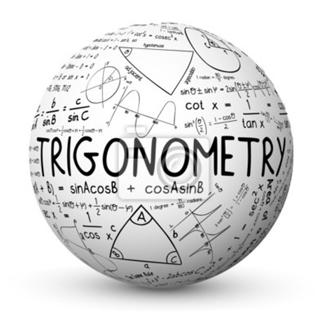
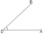

# Introduction

- Trigonometry is a branch of Mathematics that studies the relationships between the ratios of side lengths and angles of a triangle. It also involves solving problems related to the ratios. 
- It gets its name from the Greek words: "treîs" (three) + "gōnía" (angles) + "metron" (measure).
- It has its applications in: Civil Engineering, Astronomy, Navigation, Acoustics, Optics, Architecture, etc.
- Has been studied by mankind for thousands of years.

{height=25%, width=25%}

# Angles and its Measurements

**Angle:** Let a ray $\vec{OA}$, when rotated about its end point $O$, results in the position $OB$. Then we say that the angle $\angle AOB$ has been generated.  
{height=20%, width=20%}

The initial position $OA$ is called the *initial side* and the final position $OB$ is called the *terminal side* of the angle. The end point $O$ is called the *vertex* of the angle.

**Measure of an Angle: ** The amount of rotation performed or the amount of *circular distance* travelled by the ray is called the measure of an angle. 

**Sign Convention:** The sign of the angle is considered to be positive or negativeistalyporquesmakiportari, according as the ray is rotated in the anticlockwise or the clockwise direction. 
Hello  
Hello  
Hello  
Hello  
Hello  
Hello  
Hello  
Hello  
Hello  
Hello  

{height=50%, width=50%}

## Slide header 1

- A first item with some equation $x^y$
- A second item with some other equation $$(a+b)^2=a^2+bc^2$$

## Slide header 2

We will use a theorem

